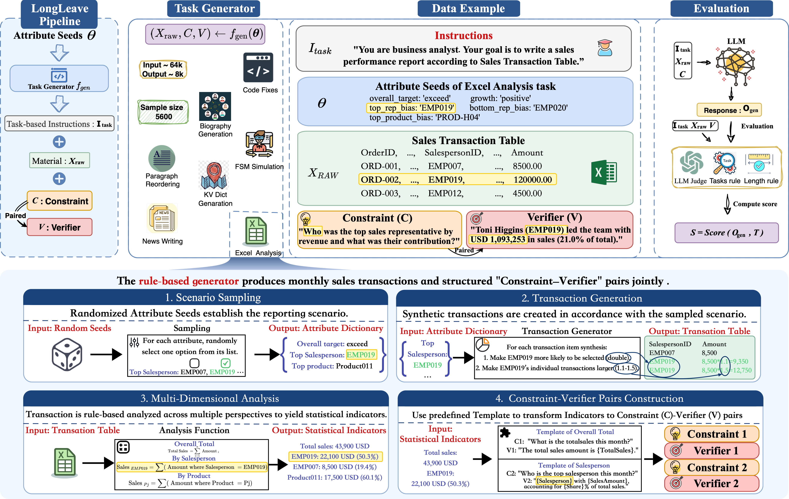

# LongWeave: A Long-Form Generation Benchmark Bridging Real-World Relevance and Verifiability

[](https://arxiv.org/pdf/2510.24345)
[](LICENSE)

Switch language: [中文](README.zh.md)

This repository is the official implementation of EMNLP 2025 paper [LongWeave](https://aclanthology.org/2025.findings-emnlp.549/).

LongWeave is an open-source framework for evaluating large language models (LLMs) on long-context generation tasks.

## Features

Task Features:

- Multiple pre-defined Long-generation tasks (code fixing, sales report generation, and more)
- Ensuring task verifiability while maintaining real-world relevance
- Configurable input (128k) and output (8k) lengths
- Unlimited generation of task samples

Evaluation Framework Features:
- Support for adding new tasks in core/tasks
- Support for various LLM backends (DashScope, OpenAI, HuggingFace, DLC). Configuring inference endpoints in core/serve. 
- Configuring task and model parameters through YAML files in config
- Concurrent inference, concurrent LLM-as-a-judge
- Interruption recovery during inference and evaluation
- Results aggregation and reporting


## Evaluation Overview

The  evaluation pipeline is illustrated in the diagram below:




## Setup Instructions

### 1. Environment Setup

First, install the required dependencies:

```bash
pip install -r requirements.txt
```

### 2. Deploy LLM Services

You can deploy local LLM services using vLLM. Here are example commands for two models:

```bash
# Deploy Llama-3.1-8B-Instruct
vllm serve /mnt/data/models/Meta-Llama-3___1-8B-Instruct \
  --served-model-name Meta-Llama-3___1-8B-Instruct \
  --tensor-parallel-size 8 \
  --trust-remote-code \
  --port 8012 \
  --enable-prefix-caching \
  --max-model-len 131072

# Deploy Qwen3-8B
vllm serve /mnt/data/models/Qwen/Qwen3-8B \
  --served-model-name qwen3-8b \
  --tensor-parallel-size 8 \
  --trust-remote-code \
  --port 8012 \
  --enable-prefix-caching \
  --max-model-len 131072 \
  --rope-scaling '{"type":"yarn","factor":4.0, "original_max_position_embeddings":32768,"rope_type": "yarn"}' \
  --chat-template ./qwen3_nonthinking.jinja
```

### 3. Configure LLM Endpoints

After deploying the LLM services, update the endpoint configurations in [core/serve/dlc.py](core/serve/dlc.py) to match the IP addresses of your deployed services:

```python
MODEL_TO_API_BASE = {
    "Meta-Llama-3___1-8B-Instruct": "http://YOUR_IP_ADDRESS:8012/v1",
    "qwen3-8b": "http://YOUR_IP_ADDRESS:8012/v1",
}
```

Ensure the internal connectivity is working by testing the endpoints.

### 4. Extract Dataset

Extract the dataset archive to prepare the evaluation data:

```bash
tar -xf data.tar.xz -C .
```

### 5. Configure Task and Model Parameters

Modify the configuration files in the [config/](config/) directory:

- [global_config.yaml](config/global_config.yaml): Select tasks to run and configure threading
- [model_config.yaml](config/model_config.yaml): Select which model to evaluate
- [task_config.yaml](config/task_config.yaml): Configure task-specific parameters


### 6. Run Evaluation

Execute the main script to run inference and evaluation:

```bash
python main.py
```

The results will be saved in the [results/](results/) directory, organized by model name.

### 7. Generate Summary Report

After running evaluations on multiple models, generate a summary report:

```bash
python generate_summary.py
```

This will create both CSV and Excel summary reports in the current directory.

## Adding New Tasks

To add new tasks, create a new task implementation in the [core/tasks/](core/tasks/) directory by extending the base task class.

## Project Structure

```
longweave_open/
├── config/                 # Configuration files
│   ├── global_config.yaml  # Global settings
│   ├── model_config.yaml   # Model settings
│   └── task_config.yaml    # Task settings
├── core/                   # Core framework components
│   ├── metrics/            # Evaluation metrics
│   ├── serve/              # LLM API interfaces
│   ├── simulation/         # Data generation tools
│   ├── tasks/              # Task implementations
│   ├── pipeline.py         # Execution pipeline
│   ├── runner.py           # Task runner
│   └── seed.py             # Random seed management
├── data/                   # Evaluation datasets (after extraction)
├── results/                # Evaluation results
├── main.py                 # Main execution script
└── generate_summary.py     # Results aggregation script
```

## Dataset

- We also host the evaluation data on Hugging Face: [LongWeave dataset](https://huggingface.co/datasets/zikaixiao1/LongWeave).
- Note: This GitHub repository is self-contained and can generate all evaluation data from scratch. The Hugging Face copy is provided for inspection and any additional/alternative uses.

## Citation

```bibtex
@inproceedings{xiao-etal-2025-longweave,
    title = "{L}ong{W}eave: A Long-Form Generation Benchmark Bridging Real-World Relevance and Verifiability",
    author = "Xiao, Zikai and Huang, Fei and Tu, Jianhong and Wei, Jianhui  and Ma, Wen and Zhou, Yuxuan and Wu, Jian and Yu, Bowen and Liu, Zuozhu and Lin, Junyang",
    editor = "Christodoulopoulos, Christos and Chakraborty, Tanmoy and Rose, Carolyn and Peng, Violet",
    booktitle = "Findings of the Association for Computational Linguistics: EMNLP 2025",
    month = nov,
    year = "2025",
    address = "Suzhou, China",
    publisher = "Association for Computational Linguistics",
    url = "https://aclanthology.org/2025.findings-emnlp.549/",
    pages = "10386--10417",
    ISBN = "979-8-89176-335-7",
}
```
## License

This project is licensed under the MIT License - see the [LICENSE](LICENSE) file for details.
